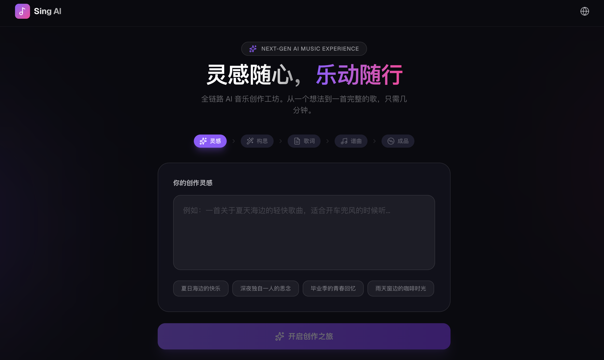

# 🎵 AI Music Workshop (Sing)

[](https://nextjs.org/)
[](https://tailwindcss.com/)
[](https://www.typescriptlang.org/)
[](LICENSE)

**AI Music Workshop** 是一个全链路 AI 音乐创作平台。只需输入一个简单的灵感，它就能助你完成从创意构思、歌词创作到最终谱曲生成的全过程。



## ✨ 核心特性

- 🚀 **全链路创作**：灵感 → 构思 → 歌词 → 谱曲，一气呵成。
- 🤖 **MiniMax AI 驱动**：深度集成 MiniMax 海螺 AI 模型，支持文本生成、歌词创作及高品质音乐生成。
- 🎭 **双版本生成**：每首歌曲同步生成 **女声** 与 **男声** 两个版本，满足不同审美。
- 🎸 **风格定制**：内置数十种音乐流派（流行、摇滚、古风等）与情绪标签。
- 📱 **响应式设计**：基于 Tailwind CSS 4 构建，完美适配桌面与移动端。
- 🎨 **现代化 UI**：拥有极光背景动画、毛玻璃特效（Glassmorphism）以及流畅的交互体验。

## 🚀 快速开始

### 1. 克隆仓库
```bash
git clone https://github.com/your-username/ai-music-workshop.git
cd ai-music-workshop
```

### 2. 安装依赖
```bash
npm install
```

### 3. 配置环境变量
在项目根目录创建 `.env.local` 文件，并填入你的 MiniMax API Key：
```env
# 获取地址: https://platform.minimaxi.com/
MINIMAX_API_KEY=your_minimax_api_key_here
```

### 4. 运行开发服务器
```bash
npm run dev
```
打开 [http://localhost:3000](http://localhost:3000) 即可访问。

## 📖 使用指南

1.  **输入灵感**：在首页输入你对歌曲的想法（如：心情、场景或主题）。
2.  **创意构思**：AI 会为你扩展出具体的歌曲背景、风格标签和建议标题。
3.  **歌词生成**：点击生成歌词，AI 会根据构思创作完整的歌词。你还可以手动微调风格标签。
4.  **谱曲生成**：点击生成音乐，系统将并行请求生成女声和男声两个版本的 MP3。
5.  **播放与下载**：在线试听生成的歌曲，并支持一键下载 MP3 到本地。

## 📂 项目结构

```text
src/
├── app/
│   ├── api/           # API 路由
│   │   ├── chat/      # 创意构思生成 (MiniMax-M2.7)
│   │   ├── lyrics/    # 歌词生成 (lyrics_generation)
│   │   └── music/     # 音乐生成 (music-2.6)
│   ├── layout.tsx     # 全局布局 (含导航栏与页脚)
│   ├── page.tsx       # 入口页面
│   └── globals.css    # 全局样式与毛玻璃特效定义
├── components/
│   └── MusicWorkshop.tsx # 核心工作流组件 (状态管理与交互)
└── public/            # 静态资源 (Logo, Demo 截图)
```

## 🛠️ 技术栈详情

- **框架**: Next.js 15 (App Router)
- **核心库**: React 19, Lucide React (图标)
- **样式**: Tailwind CSS 4, PostCSS
- **API 对接**: MiniMax (海螺 AI) 开放平台

## 📝 路线图

- [ ] 支持在线实时编辑并重新生成部分歌词
- [ ] 引入音频剪辑与简易混音预览功能
- [ ] 个人作品集/本地存储功能
- [ ] 多语言支持 (English/Japanese)

## 📄 开源协议

本项目采用 [MIT License](LICENSE) 开源协议。

---

*Made with ❤️ by AI Music Workshop Team*
